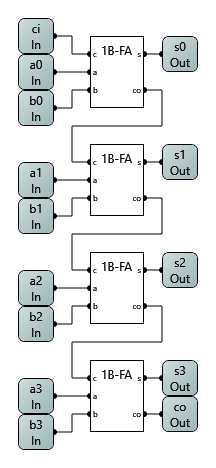

# LogicCircuit - Computer Architecture

Here you can find the complete [LogicCircuit](http://www.logiccircuit.org/) project file with all logic circuits for exercises of Kassel university's computer architecture lecture.

The project also contains test circuits for several logic circuits.

## Images

  
1-bit-alu

  

  
1-bit-full_adder

  

  
1-bit-full_subtractor

  

  
1-bit-half_adder

  

  
1-bit-half_subtractor

  

  
1-bit-multiplexer

  

  
2-bit-multiplexer

  

  
4-bit-add_sub

  

  
4-bit-alu

  

  
4-bit-asynchronous-counter

  

  
4-bit-bcd-adder

  

  
4-bit-multiplexer

  

  
4-bit-ripple-carry-full_adder

  

  
4-bit-ripple_carry-full_subtractor

  

  
4-bit-synchronous-counter

  

  
7-segment-decoder

  

  
8-bit-register

  

  
8-bit-shift_register

  

  
8x8-or

  

  
address_decoder

  

  
chip-enable

  

  
d-master_slave-flip_flop

  

  
jk-master_slave-flip_flop

  

  
ram+ce

  

  
rs-flip_flop

  

  
rom+ce

  

  
rs-master_slave-flip_flop

  

  
t-master_slave-flip_flop

  

